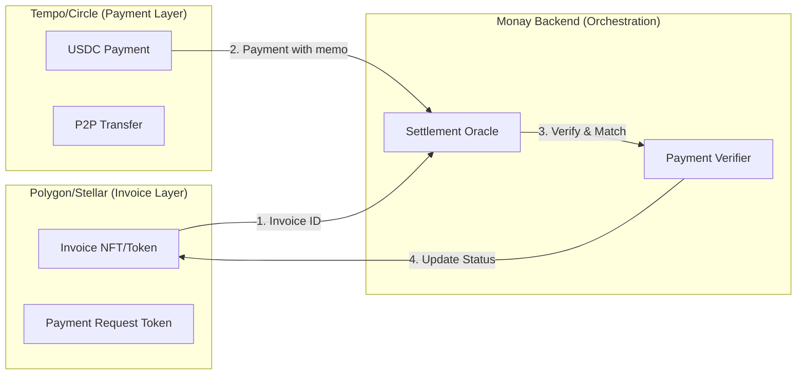

# Cross-Chain Invoice Settlement Architecture
## Tokenize on One Chain, Settle on Another
**Date**: September 26, 2025

---

## 🎯 Core Concept: Separation of Concerns

**Invoice Token** (Polygon/Stellar) = The debt obligation record
**Payment Settlement** (Tempo/Circle) = The actual value transfer

These are **completely separate** and can operate on different chains!

---

## 🔄 How Cross-Chain Settlement Works



---

## 💡 Revolutionary Architecture Design

### The Invoice is just a POINTER, not the VALUE

```javascript
// Invoice on Polygon (cheap chain)
Invoice {
    id: "INV-2025-001",
    amount: 1000.00,
    issuer: "0xEnterprise...",
    recipient: "0xConsumer...",
    status: "PENDING",
    settlementChain: "TEMPO",  // Where payment happens
    settlementAddress: "tempo_wallet_123"
}

// Payment on Tempo (fast chain)
Payment {
    amount: 1000.00,
    from: "consumer_wallet",
    to: "enterprise_wallet",
    memo: "INV-2025-001"  // Links to invoice
}

// Monay Backend connects them
async function settleInvoice(invoiceId, paymentTx) {
    // Verify payment on Tempo/Circle
    const payment = await tempo.verifyTransaction(paymentTx);

    // Update invoice on Polygon
    await polygonContract.markAsPaid(invoiceId, paymentTx);

    // Record in database
    await db.recordSettlement(invoiceId, paymentTx);
}
```

---

## 🏗️ Complete Multi-Chain Architecture

### 1. **Invoice/Request Creation** (Polygon or Stellar)

#### For Enterprise Invoices (B2C):
```javascript
// Mint on Polygon (EVM, good for enterprises)
async function createEnterpriseInvoice(data) {
    const invoice = await polygonContract.mintInvoice({
        recipient: data.customerId,
        amount: data.amount,
        metadata: ipfsHash,
        settlementNetwork: 'TEMPO' // or 'CIRCLE'
    });

    // Cost: $0.001 on Polygon
    return invoice.id;
}
```

#### For P2P Payment Requests (C2C):
```javascript
// Create on Stellar (super cheap for consumers)
async function createPaymentRequest(data) {
    const request = await stellar.createAsset({
        code: `REQ${Date.now()}`,
        amount: data.amount,
        issuer: data.requesterId,
        memo: data.description
    });

    // Cost: $0.00001 on Stellar
    return request.id;
}
```

### 2. **Payment Settlement** (Tempo/Circle)

```javascript
// Same settlement function for both invoice types
async function settlePayment(documentId, documentType) {
    // Get the invoice/request from appropriate chain
    let document;
    if (documentType === 'INVOICE') {
        document = await polygonContract.getInvoice(documentId);
    } else {
        document = await stellar.getRequest(documentId);
    }

    // Execute payment on Tempo (primary)
    try {
        const payment = await tempo.transfer({
            from: payerWallet,
            to: document.settlementAddress,
            amount: document.amount,
            memo: documentId  // Critical: links payment to invoice
        });

        // Update status on original chain
        await updateDocumentStatus(documentId, documentType, 'PAID', payment.hash);

    } catch (tempoError) {
        // Fallback to Circle
        const payment = await circle.transfer({...});
    }
}
```

---

## 🔍 Why This Architecture is Brilliant

### 1. **Cost Optimization**
| Operation | Chain | Cost | Why |
|-----------|-------|------|-----|
| Create Invoice | Polygon | $0.001 | Cheap for thousands |
| Create P2P Request | Stellar | $0.00001 | Nearly free |
| Pay Invoice | Tempo | $0.0001 | Fast settlement |
| Update Status | Polygon/Stellar | $0.001 | Infrequent updates |

**Total cost per transaction: ~$0.002**

### 2. **Speed Optimization**
- Invoice creation: 2-3 seconds (doesn't need to be instant)
- Payment settlement: <100ms on Tempo (needs to be instant)
- Status update: 2-3 seconds (can be async)

### 3. **Compliance Separation**
- **Invoice tokens**: Not securities, just debt records
- **Payment tokens**: Regulated stablecoins (USDC)
- **Clean separation**: Regulatory clarity

---

## 📱 Universal Request-to-Pay System

### For P2P Payments (Consumer to Consumer)

```javascript
class UniversalRequestToPay {
    // Create request (cheap chain)
    async createRequest(requesterId, payerId, amount, description) {
        // Use Stellar for consumer requests (cheapest)
        const request = await stellar.operations.payment({
            destination: payerId,
            asset: Asset.native(),
            amount: '0.0000001',  // Dust amount to create request
            memo: JSON.stringify({
                type: 'PAYMENT_REQUEST',
                amount: amount,
                description: description,
                settlementNetwork: 'TEMPO'
            })
        });

        // Store in database
        await db.PaymentRequests.create({
            id: request.hash,
            requesterId,
            payerId,
            amount,
            status: 'PENDING',
            chain: 'STELLAR',
            settlementChain: 'TEMPO'
        });

        return request.hash;
    }

    // Approve and pay (fast chain)
    async approveAndPay(requestId, payerId) {
        const request = await db.PaymentRequests.findById(requestId);

        // Pay on Tempo
        const payment = await tempo.transfer({
            from: payerId,
            to: request.requesterId,
            amount: request.amount,
            memo: requestId
        });

        // Update request status
        await stellar.submitTransaction(
            Operation.setOptions({
                homeDomain: `paid:${payment.hash}`
            })
        );

        await db.PaymentRequests.update(requestId, {
            status: 'PAID',
            paymentHash: payment.hash,
            paidAt: new Date()
        });
    }
}
```

### For Business Invoices (B2C)

```javascript
class EnterpriseInvoiceSystem {
    // Create invoice (Polygon for businesses)
    async createInvoice(enterpriseId, customerId, items, amount) {
        // Mint NFT invoice on Polygon
        const invoice = await polygonContract.mintInvoice({
            issuer: enterpriseId,
            recipient: customerId,
            amount: amount,
            items: ipfsHash(items),
            dueDate: Date.now() + 30 * 24 * 60 * 60 * 1000,
            settlementOptions: ['TEMPO', 'CIRCLE']  // Accept both
        });

        return invoice;
    }

    // Pay invoice (Tempo/Circle)
    async payInvoice(invoiceId, payerId, amount) {
        const invoice = await polygonContract.getInvoice(invoiceId);

        // Smart routing based on amount
        let payment;
        if (amount < 1000) {
            // Small amounts: use Tempo for speed
            payment = await tempo.transfer({...});
        } else {
            // Large amounts: use Circle for reliability
            payment = await circle.transfer({...});
        }

        // Update invoice on Polygon
        await polygonContract.recordPayment(invoiceId, payment.hash, amount);
    }
}
```

---

## 🌐 Oracle-Based Settlement Verification

### The Monay Settlement Oracle

```javascript
class SettlementOracle {
    constructor() {
        // Monitor multiple chains
        this.chains = {
            invoice: new PolygonProvider(),
            requests: new StellarProvider(),
            payments: new TempoProvider(),
            fallback: new CircleProvider()
        };
    }

    async monitorAndSettle() {
        // Listen for payment events on Tempo/Circle
        tempo.on('payment', async (payment) => {
            const documentId = payment.memo;

            // Determine document type and chain
            const document = await this.findDocument(documentId);

            if (document) {
                // Verify payment matches invoice/request
                if (payment.amount >= document.amount) {
                    // Update status on appropriate chain
                    await this.updateDocumentStatus(
                        document.chain,
                        documentId,
                        'PAID',
                        payment.hash
                    );

                    // Handle overpayment
                    if (payment.amount > document.amount) {
                        await this.createCredit(
                            payment.from,
                            payment.to,
                            payment.amount - document.amount
                        );
                    }
                }
            }
        });
    }

    async updateDocumentStatus(chain, documentId, status, paymentHash) {
        switch(chain) {
            case 'POLYGON':
                await polygonContract.updateInvoice(documentId, status, paymentHash);
                break;
            case 'STELLAR':
                await stellar.updateRequest(documentId, status, paymentHash);
                break;
        }
    }
}
```

---

## 🎨 Complete Flow Diagrams

### Enterprise Invoice Flow
```
1. Enterprise creates invoice → Polygon (cheap)
2. Consumer receives invoice notification → Read from Polygon (free)
3. Consumer pays with USDC → Tempo (fast)
4. Oracle detects payment → Backend service
5. Oracle updates invoice → Polygon (cheap)
6. Both parties see "PAID" status → Read from Polygon (free)
```

### P2P Request-to-Pay Flow
```
1. Consumer A creates request → Stellar (nearly free)
2. Consumer B receives request → Read from Stellar (free)
3. Consumer B approves & pays → Tempo (instant)
4. Oracle detects payment → Backend service
5. Oracle updates request → Stellar (nearly free)
6. Both see completed transfer → Read from Stellar (free)
```

---

## 💰 Cost Comparison

### Traditional Single-Chain Approach
If everything on Ethereum: **$5-15 per transaction** ❌

### Our Multi-Chain Approach
| Step | Chain | Cost |
|------|-------|------|
| Create Invoice/Request | Polygon/Stellar | $0.001/$0.00001 |
| Payment | Tempo | $0.0001 |
| Status Update | Polygon/Stellar | $0.001/$0.00001 |
| **Total** | **Multi-chain** | **~$0.002** ✅ |

**2,500x cheaper than Ethereum!**

---

## 🔧 Implementation Components

### 1. Smart Contracts

#### Polygon Invoice Contract
```solidity
contract InvoiceRegistry {
    struct Invoice {
        uint256 id;
        address issuer;
        address recipient;
        uint256 amount;
        string settlementNetwork; // "TEMPO" or "CIRCLE"
        string paymentHash;       // Cross-chain payment proof
        InvoiceStatus status;
    }

    mapping(uint256 => Invoice) public invoices;

    function updateWithPayment(
        uint256 invoiceId,
        string memory paymentHash,
        string memory network
    ) external onlyOracle {
        invoices[invoiceId].paymentHash = paymentHash;
        invoices[invoiceId].status = InvoiceStatus.PAID;
        emit InvoicePaid(invoiceId, paymentHash, network);
    }
}
```

#### Stellar Request Handler
```javascript
// Lightweight request creation
async function createStellarRequest(from, to, amount) {
    const request = new TransactionBuilder(account, {
        fee: BASE_FEE,  // $0.00001
        networkPassphrase: Networks.PUBLIC
    })
    .addOperation(Operation.payment({
        destination: to,
        asset: Asset.native(),
        amount: "0.0000001"  // Dust to create request
    }))
    .addMemo(Memo.text(`REQ:${amount}:TEMPO`))
    .build();

    return request;
}
```

### 2. Backend Services

```javascript
// Unified settlement service
class UnifiedSettlementService {
    async processPayment(paymentData) {
        // 1. Identify document from memo
        const documentId = paymentData.memo;

        // 2. Find document across chains
        const document = await this.findDocument(documentId);

        // 3. Verify payment amount
        if (paymentData.amount >= document.requiredAmount) {
            // 4. Update on appropriate chain
            await this.updateDocumentChain(document);

            // 5. Notify parties
            await this.notifySettlement(document, paymentData);
        }
    }

    async findDocument(id) {
        // Check Polygon for invoices
        const invoice = await polygonProvider.getInvoice(id);
        if (invoice) return { type: 'invoice', chain: 'polygon', ...invoice };

        // Check Stellar for requests
        const request = await stellarProvider.getRequest(id);
        if (request) return { type: 'request', chain: 'stellar', ...request };

        return null;
    }
}
```

---

## 🎯 Key Benefits Summary

1. **Ultra-Low Cost**: $0.002 total per transaction
2. **Blazing Fast**: <100ms payment settlement
3. **Infinitely Scalable**: Different chains for different purposes
4. **Regulatory Compliant**: Clean separation of concerns
5. **Universal**: Works for B2C invoices AND C2C requests
6. **Future-Proof**: Can add more chains as needed

---

## 🚀 This Architecture Enables

- **Millions of invoices** without breaking the bank
- **Instant P2P payments** with request-to-pay
- **Complete audit trails** across multiple chains
- **Enterprise-grade compliance** with consumer-friendly costs
- **Global scalability** without performance compromise

---

**Conclusion**: Yes, absolutely you can tokenize on one chain and settle on another! In fact, it's the OPTIMAL approach for cost, speed, and compliance.

*Architecture Date: September 26, 2025*
*Innovation: Cross-Chain Invoice Settlement*