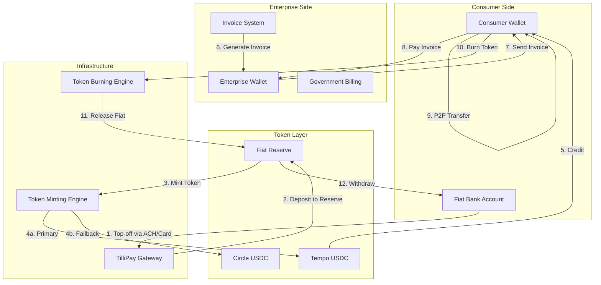

# Monay Invoice-First Payment Architecture
## Complete Token Flow Design with Tempo/Circle Integration
**Version**: 2.0
**Date**: September 26, 2025
**Status**: Architecture Design - Partial Implementation

---

## 🎯 Core Vision

A revolutionary **invoice-first payment system** where:
- **No money moves without an invoice** (except P2P with request-to-pay)
- **Tokens are minted against fiat deposits** (Tempo primary, Circle secondary)
- **Enterprises must raise invoices** before receiving payments
- **Full audit trail** from fiat deposit to token burn

---

## 📊 System Architecture Overview



---

## 🔄 Detailed Process Flows

### 1️⃣ **Wallet Top-Off (Fiat → Token)**

#### Process Steps:
```javascript
async function topOffWallet(userId, amount, paymentMethod) {
  // Step 1: Initiate fiat deposit via TilliPay
  const deposit = await tilliPay.initiateDeposit({
    userId,
    amount,
    method: paymentMethod, // 'ACH', 'CARD', 'WIRE'
    destination: 'RESERVE_ACCOUNT'
  });

  // Step 2: Wait for confirmation
  await tilliPay.waitForConfirmation(deposit.id);

  // Step 3: Record fiat deposit in reserve
  const reserve = await db.FiatReserve.create({
    userId,
    amount,
    depositId: deposit.id,
    status: 'CONFIRMED',
    timestamp: new Date()
  });

  // Step 4: Mint equivalent tokens (Tempo primary)
  let token;
  try {
    token = await tempo.mintToken({
      userId,
      amount,
      reserveId: reserve.id,
      metadata: {
        source: 'FIAT_DEPOSIT',
        depositMethod: paymentMethod
      }
    });
  } catch (tempoError) {
    // Fallback to Circle
    console.log('Tempo failed, using Circle:', tempoError);
    token = await circle.mintToken({
      userId,
      amount,
      reserveId: reserve.id
    });
  }

  // Step 5: Credit consumer wallet
  const wallet = await db.ConsumerWallet.findOne({ userId });
  await wallet.credit({
    amount: token.amount,
    tokenId: token.id,
    provider: token.provider, // 'tempo' or 'circle'
    txHash: token.transactionHash
  });

  // Step 6: Create audit trail
  await db.AuditLog.create({
    userId,
    action: 'WALLET_TOP_OFF',
    amount,
    fiatDepositId: deposit.id,
    tokenMintId: token.id,
    walletBalance: wallet.balance
  });

  return {
    success: true,
    newBalance: wallet.balance,
    tokenProvider: token.provider,
    transactionId: token.id
  };
}
```

#### Security & Compliance:
- **KYC Levels**: Progressive limits ($1k → $50k → $250k daily)
- **AML Checks**: Real-time transaction monitoring
- **Reserve Backing**: 1:1 fiat backing for all minted tokens
- **Audit Trail**: Complete tracking from deposit to mint

---

### 2️⃣ **Invoice-Based Payments (Consumer → Enterprise)**

#### Process Steps:
```javascript
async function payInvoice(consumerId, invoiceId, paymentAmount) {
  // Step 1: Validate invoice
  const invoice = await db.Invoice.findById(invoiceId);
  if (!invoice || invoice.status !== 'PENDING') {
    throw new Error('Invalid or already paid invoice');
  }

  // Step 2: Check consumer wallet balance
  const consumerWallet = await db.ConsumerWallet.findOne({ userId: consumerId });
  if (consumerWallet.balance < paymentAmount) {
    throw new Error('Insufficient balance');
  }

  // Step 3: Validate payment amount
  const paymentValidation = validatePayment(invoice, paymentAmount);
  // paymentValidation can be: EXACT, PARTIAL, OVERPAYMENT

  // Step 4: Lock tokens for transfer
  const lockedTokens = await consumerWallet.lockTokens({
    amount: paymentAmount,
    purpose: 'INVOICE_PAYMENT',
    invoiceId
  });

  // Step 5: Transfer to enterprise wallet
  const enterpriseWallet = await db.EnterpriseWallet.findOne({
    enterpriseId: invoice.issuerId
  });

  const transfer = await tokenTransfer({
    from: consumerWallet.address,
    to: enterpriseWallet.address,
    amount: paymentAmount,
    tokenProvider: lockedTokens.provider,
    metadata: {
      invoiceId,
      paymentType: paymentValidation.type
    }
  });

  // Step 6: Update invoice status
  await invoice.update({
    paidAmount: invoice.paidAmount + paymentAmount,
    status: paymentValidation.type === 'EXACT' ? 'PAID' :
            paymentValidation.type === 'PARTIAL' ? 'PARTIALLY_PAID' :
            'OVERPAID',
    lastPaymentDate: new Date()
  });

  // Step 7: Handle overpayment if applicable
  if (paymentValidation.type === 'OVERPAYMENT') {
    const excess = paymentAmount - invoice.remainingAmount;
    await db.CustomerCredit.create({
      customerId: consumerId,
      enterpriseId: invoice.issuerId,
      amount: excess,
      sourceInvoiceId: invoiceId,
      status: 'AVAILABLE'
    });
  }

  // Step 8: Create payment record
  await db.Payment.create({
    invoiceId,
    consumerId,
    enterpriseId: invoice.issuerId,
    amount: paymentAmount,
    tokenTransferId: transfer.id,
    status: 'COMPLETED'
  });

  return {
    success: true,
    paymentId: transfer.id,
    invoiceStatus: invoice.status,
    remainingBalance: invoice.amount - invoice.paidAmount,
    customerCredit: paymentValidation.excess || 0
  };
}
```

#### Invoice Generation (Enterprise Side):
```javascript
async function generateInvoice(enterpriseId, customerId, invoiceData) {
  // Only enterprises can generate invoices
  const enterprise = await db.Enterprise.findById(enterpriseId);
  if (!enterprise.verified) {
    throw new Error('Enterprise not verified');
  }

  const invoice = await db.Invoice.create({
    issuerId: enterpriseId,
    customerId,
    amount: invoiceData.amount,
    dueDate: invoiceData.dueDate,
    description: invoiceData.description,
    lineItems: invoiceData.items,
    status: 'PENDING',
    metadata: {
      category: invoiceData.category, // 'UTILITY', 'GOVERNMENT', 'HEALTHCARE', etc.
      recurring: invoiceData.recurring
    }
  });

  // Notify customer
  await notificationService.sendInvoice(customerId, invoice);

  return invoice;
}
```

---

### 3️⃣ **P2P Transfers (Consumer → Consumer)**

#### Process Steps:
```javascript
async function p2pTransfer(senderId, recipientId, amount, requestId) {
  // Step 1: Validate request-to-pay (invoice-like for P2P)
  const paymentRequest = await db.PaymentRequest.findById(requestId);
  if (!paymentRequest || paymentRequest.status !== 'PENDING') {
    throw new Error('Invalid payment request');
  }

  // Step 2: Check sender balance
  const senderWallet = await db.ConsumerWallet.findOne({ userId: senderId });
  if (senderWallet.balance < amount) {
    throw new Error('Insufficient balance');
  }

  // Step 3: Get recipient wallet
  const recipientWallet = await db.ConsumerWallet.findOne({ userId: recipientId });

  // Step 4: Execute transfer (instant on Tempo)
  const transfer = await tempo.transfer({
    from: senderWallet.address,
    to: recipientWallet.address,
    amount,
    metadata: {
      type: 'P2P',
      requestId
    }
  });

  // Step 5: Update wallets
  await senderWallet.debit(amount);
  await recipientWallet.credit(amount);

  // Step 6: Update payment request
  await paymentRequest.update({
    status: 'PAID',
    paidAt: new Date(),
    transactionId: transfer.id
  });

  return {
    success: true,
    transactionId: transfer.id,
    settlementTime: transfer.settlementTime // <100ms on Tempo
  };
}
```

---

### 4️⃣ **Off-Ramping (Token → Fiat)**

#### Process Steps:
```javascript
async function offRamp(userId, amount, withdrawalMethod) {
  // Step 1: Check wallet balance
  const wallet = await db.ConsumerWallet.findOne({ userId });
  if (wallet.balance < amount) {
    throw new Error('Insufficient balance');
  }

  // Step 2: Lock tokens for burn
  const lockedTokens = await wallet.lockTokens({
    amount,
    purpose: 'OFF_RAMP'
  });

  // Step 3: Burn tokens on appropriate network
  let burnResult;
  if (lockedTokens.provider === 'tempo') {
    burnResult = await tempo.burnToken({
      userId,
      amount,
      tokenIds: lockedTokens.ids
    });
  } else {
    burnResult = await circle.burnToken({
      userId,
      amount,
      tokenIds: lockedTokens.ids
    });
  }

  // Step 4: Release fiat from reserve
  const reserveRelease = await db.FiatReserve.release({
    userId,
    amount,
    burnTransactionId: burnResult.id
  });

  // Step 5: Initiate fiat withdrawal via TilliPay
  const withdrawal = await tilliPay.initiateWithdrawal({
    userId,
    amount,
    method: withdrawalMethod, // 'ACH', 'WIRE', 'DEBIT_CARD'
    reserveReleaseId: reserveRelease.id
  });

  // Step 6: Update wallet balance
  await wallet.debit(amount);

  // Step 7: Create audit trail
  await db.AuditLog.create({
    userId,
    action: 'OFF_RAMP',
    amount,
    tokenBurnId: burnResult.id,
    fiatWithdrawalId: withdrawal.id,
    remainingBalance: wallet.balance
  });

  return {
    success: true,
    withdrawalId: withdrawal.id,
    estimatedArrival: withdrawal.estimatedArrival,
    remainingBalance: wallet.balance
  };
}
```

---

## 💡 Key Design Principles

### 1. **Invoice-First Architecture**
- **No unauthorized transfers**: Money only moves with proper documentation
- **Enterprise invoicing**: Businesses must issue invoices to receive payment
- **Government compliance**: Perfect for tax collection, benefits distribution
- **Audit trail**: Complete documentation for every transaction

### 2. **Token Reserve Management**
```javascript
class FiatReserveManager {
  // Maintain 1:1 backing
  async validateReserve() {
    const totalMinted = await this.getTotalMintedTokens();
    const reserveBalance = await this.getReserveFiatBalance();

    if (totalMinted !== reserveBalance) {
      throw new Error('Reserve mismatch detected');
    }

    return {
      tokensInCirculation: totalMinted,
      fiatReserve: reserveBalance,
      ratio: '1:1'
    };
  }

  // Daily reconciliation
  async reconcile() {
    const tempoTokens = await tempo.getTotalSupply();
    const circleTokens = await circle.getTotalSupply();
    const totalTokens = tempoTokens + circleTokens;

    const reserveAccounts = await this.getAllReserveAccounts();
    const totalFiat = reserveAccounts.reduce((sum, acc) => sum + acc.balance, 0);

    return {
      tokens: totalTokens,
      fiat: totalFiat,
      balanced: totalTokens === totalFiat
    };
  }
}
```

### 3. **Provider Hierarchy**
- **Primary**: Tempo (100,000+ TPS, $0.0001 fees, <100ms settlement)
- **Fallback**: Circle (65 TPS, standard fees, 2-3s settlement)
- **Future**: Monay proprietary rails

### 4. **Compliance & Security**
- **KYC/AML**: Progressive verification levels
- **Transaction Monitoring**: Real-time fraud detection
- **Sanctions Screening**: OFAC compliance
- **Data Encryption**: End-to-end encryption for sensitive data

---

## 🚧 Implementation Status

### ✅ Completed:
1. **Backend Services**:
   - `consumer-wallet-service.js` - Basic wallet operations
   - `tempo.js` - Tempo integration
   - `circle.js` - Circle integration
   - `stablecoin-provider-factory.js` - Provider abstraction

2. **Database Tables**:
   - `invoices` - Invoice management
   - `consumer_wallets` - Wallet tracking
   - `stablecoin_balances` - Multi-token support
   - `payment_requests` - P2P requests

3. **API Routes**:
   - `/api/consumer/*` - Consumer endpoints
   - `/api/circle-wallets/*` - Circle operations

### 🔄 In Progress:
1. **Invoice System**:
   - Enterprise invoice generation UI
   - Invoice payment flow in consumer wallet

2. **Token Operations**:
   - Minting engine integration
   - Burning mechanism

### ❌ Not Yet Implemented:
1. **TilliPay Integration**:
   - On-ramp flow
   - Off-ramp flow
   - Reserve management

2. **Enterprise Wallet**:
   - Invoice creation API
   - Payment receipt handling
   - Credit management for overpayments

3. **P2P System**:
   - Request-to-pay UI
   - QR code generation
   - Contact management

4. **Government Integration**:
   - Benefits distribution
   - Tax collection
   - Compliance reporting

---

## 📋 Implementation Roadmap

### Phase 1: Core Infrastructure (Week 1-2)
- [ ] Complete TilliPay integration
- [ ] Implement reserve management system
- [ ] Build token minting/burning engine
- [ ] Set up reconciliation jobs

### Phase 2: Invoice System (Week 3-4)
- [ ] Enterprise invoice generation API
- [ ] Consumer invoice payment flow
- [ ] Overpayment credit system
- [ ] Invoice status tracking

### Phase 3: P2P Transfers (Week 5)
- [ ] Request-to-pay system
- [ ] QR code payments
- [ ] Contact management
- [ ] Transaction history

### Phase 4: Off-Ramp Flow (Week 6)
- [ ] Token burning mechanism
- [ ] Fiat withdrawal API
- [ ] Bank account linking
- [ ] Withdrawal limits

### Phase 5: Testing & Security (Week 7-8)
- [ ] End-to-end testing
- [ ] Security audit
- [ ] Load testing
- [ ] Compliance verification

---

## 🎯 Success Metrics

| Metric | Target | Current |
|--------|--------|---------|
| On-ramp completion rate | >95% | Pending |
| Invoice payment success | >99% | Pending |
| P2P transfer speed | <100ms | Pending |
| Off-ramp processing time | <24hrs | Pending |
| Token-fiat reserve ratio | 1:1 | Pending |
| System uptime | 99.99% | Pending |

---

## 🔐 Security Considerations

### Multi-Layer Security:
1. **Application Layer**: JWT auth, rate limiting, input validation
2. **Blockchain Layer**: Multi-sig wallets, time-locked contracts
3. **Database Layer**: Encryption at rest, field-level encryption
4. **Network Layer**: TLS 1.3, certificate pinning
5. **Operational**: SOC2 compliance, regular audits

### Fraud Prevention:
- Velocity checks on transactions
- Geographic restrictions
- Device fingerprinting
- Behavioral analysis
- Manual review triggers

---

## 📝 Next Steps

1. **Immediate Actions**:
   - Complete TilliPay integration configuration
   - Implement token minting service
   - Build invoice generation API
   - Create P2P request system

2. **Testing Requirements**:
   - Unit tests for all services
   - Integration tests for payment flows
   - Load testing for 10,000 TPS
   - Security penetration testing

3. **Documentation Needs**:
   - API documentation
   - Integration guides
   - Compliance procedures
   - Operational runbooks

---

**This architecture provides a complete, compliant, and scalable solution for the invoice-first payment system with full token lifecycle management.**

*Last Updated: September 26, 2025*
*Status: Design Complete - Implementation In Progress*