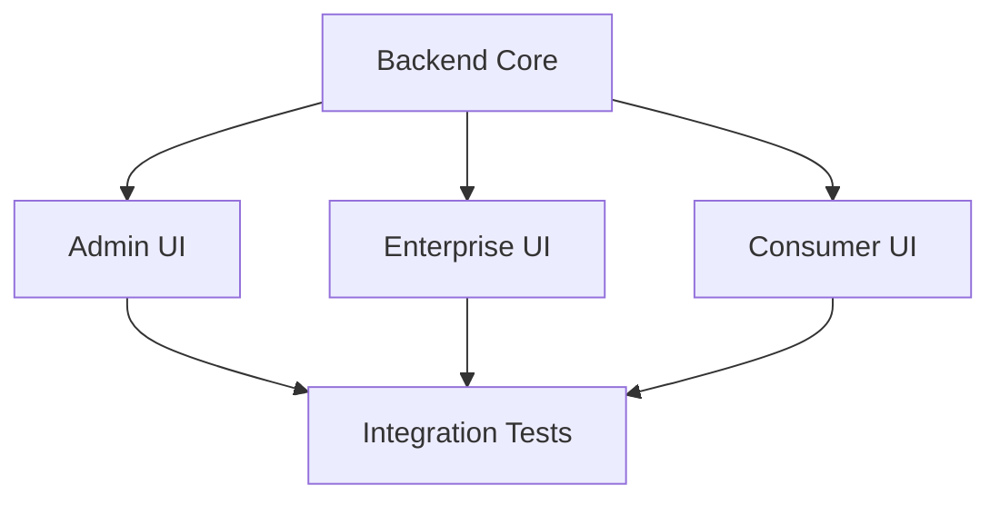

# 🚀 PARALLEL IMPLEMENTATION PLAN
## 4-5 Team Parallel Execution Strategy
**Date**: October 2025
**Objective**: Execute MonayPay transformation with minimal regression

---

## 📋 TEAM ASSIGNMENTS

### TEAM 1: BACKEND CORE (Port 3001)
**Focus**: Provider Integration & Circle Removal
**Timeline**: 2-3 weeks
**Critical Path**: Yes - Other teams depend on this

#### Week 1: Circle Removal & Provider Setup
```javascript
// Priority Tasks:
1. DELETE Circle services (5 files)
2. CREATE Cross River client
3. CREATE BitGo custody service
4. REFACTOR Tempo service (blockchain → FX)
5. UPDATE wallet-orchestrator to be provider-agnostic
```

#### Week 2: MonayPay Orchestration
```javascript
1. BUILD Router v2 with scoring algorithm
2. BUILD Dual-Entry Ledger v2
3. ADD Circuit breakers per rail
4. IMPLEMENT Reconciliation service
```

#### Week 3: Testing & Integration
```javascript
1. TEST all provider integrations
2. VERIFY ledger accuracy
3. ENSURE backward compatibility
4. DOCUMENT API changes
```

**Deliverables**:
- Working Cross River, BitGo, Tempo integrations
- Zero Circle dependencies
- MonayPay router operational
- All APIs documented

---

### TEAM 2: SUPER ADMIN (Port 3002)
**Focus**: Provider Management & BRE UI
**Timeline**: 2 weeks
**Can Start**: Immediately (UI can use mocks)

#### Week 1: Provider Management
```typescript
// New pages to create:
/providers/
  - Provider list with health status
  - Cross River configuration
  - BitGo configuration
  - Tempo configuration

// Components:
- ProviderHealthCard.tsx
- ProviderConfigForm.tsx
- RailMetricsChart.tsx
```

#### Week 2: BRE & Pricing
```typescript
// BRE Rule Management:
/bre-rules/
  - Rule editor with visual builder
  - Rule testing interface
  - Deployment tracker

// Pricing Matrix:
/pricing/
  - Segment/corridor pricing
  - Fee simulator
  - Margin calculator
```

**Deliverables**:
- Provider management UI complete
- BRE rule editor functional
- Pricing matrix configurable
- Rail health dashboard live

---

### TEAM 3: ENTERPRISE WALLET (Port 3007)
**Focus**: Invoice-to-Wallet Enhancement
**Timeline**: 2 weeks
**Can Start**: Immediately

#### Week 1: Invoice Enhancements
```typescript
// Enhance invoice creation:
- Add wallet mode selector (ephemeral/persistent/adaptive)
- Add TTL configuration for ephemeral
- Add escrow setup options
- Add bulk upload interface

// Key files to modify:
/invoices/create/page.tsx
/invoices/bulk/page.tsx (new)
```

#### Week 2: ERP & Escrow
```typescript
// ERP Integration:
/erp/
  - Connection management
  - SAP connector UI
  - Oracle connector UI
  - Sync status dashboard

// Smart Escrow:
/escrow/
  - Escrow creation wizard
  - Oracle attestation interface
  - Milestone tracking
```

**Deliverables**:
- Invoice-to-wallet flow complete
- Bulk processing operational
- ERP connectors UI ready
- Escrow management functional

---

### TEAM 4: CONSUMER WALLET (Port 3003)
**Focus**: Request-to-Pay & Self-Custody
**Timeline**: 1.5 weeks
**Can Start**: Immediately

#### Week 1: Core Features
```typescript
// Request-to-Pay:
/request-to-pay/
  - Create payment requests
  - QR code generation
  - Share via link
  - Track request status

// Ephemeral Wallets:
/wallet/ephemeral/
  - View temporary wallets
  - Countdown timers
  - Auto-destruction alerts
```

#### Week 1.5: Self-Custody
```typescript
// Self-Custody Setup:
/self-custody/
  - Device key generation
  - Backup kit creation
  - Recovery flow
  - Security settings
```

**Deliverables**:
- Request-to-Pay functional
- Ephemeral wallet visibility
- Self-custody setup complete
- Unified activity feed

---

### TEAM 5: QA & INTEGRATION (Optional)
**Focus**: Testing & Coordination
**Timeline**: Ongoing
**Can Start**: Week 2

#### Continuous Tasks:
```bash
1. Integration testing between teams
2. Provider failover testing
3. Performance benchmarking
4. Security auditing
5. Documentation updates
```

---

## 📅 SYNCHRONIZATION POINTS

### Daily Standups (15 min)
- Each team reports blockers
- API contract updates
- Dependency announcements

### Week 1 Checkpoint
- Backend: Circle removed, providers stubbed
- Frontend: UI mockups complete
- Integration: Test environment ready

### Week 2 Checkpoint
- Backend: All providers integrated
- Frontend: Connected to real APIs
- Integration: E2E tests passing

### Week 3: Final Integration
- All teams: Feature freeze
- Integration: Full system testing
- Documentation: Complete

---

## 🔄 CRITICAL DEPENDENCIES



1. **Backend MUST complete**:
   - Provider clients (Week 1)
   - API endpoints (Week 1)
   - WebSocket events (Week 1)

2. **Frontend teams CAN work with**:
   - Mock data initially
   - Gradually integrate real APIs
   - Feature flags for provider switching

---

## 🎯 MINIMAL REGRESSION APPROACH

### DO NOT TOUCH (Unless Necessary):
```javascript
// Already working - leave alone:
- Invoice-First core logic
- Business Rule Engine
- WebSocket infrastructure
- Database schema (only additions)
- Authentication/Authorization
- Existing API contracts
```

### SAFE TO MODIFY:
```javascript
// Can be changed without breaking:
- Circle service calls → BitGo/Tempo
- Provider configurations
- UI components (backwards compatible)
- New API endpoints (additive)
```

### MIGRATION STRATEGY:
```javascript
// Use feature flags:
if (process.env.USE_MONAYPAY === 'true') {
  // New MonayPay flow
  router = new RouterV2();
} else {
  // Legacy flow (temporary)
  router = new LegacyRouter();
}
```

---

## 📊 SUCCESS METRICS

| Metric | Target | Measurement |
|--------|--------|-------------|
| **Circle Dependencies** | 0 | `grep -r "circle" src/` |
| **Provider Uptime** | 99.9% | Health check dashboard |
| **API Response Time** | <200ms | Performance monitoring |
| **Test Coverage** | >80% | Jest coverage reports |
| **Invoice-to-Payment** | <30s | E2E test timing |

---

## 🚨 RISK MITIGATION

### If Backend Delayed:
- Frontend uses extended mocks
- Deploy with feature flags disabled
- Gradual rollout per provider

### If Provider APIs Unavailable:
- Use sandbox/test environments
- Build comprehensive mocks
- Document assumptions

### If Integration Issues:
- Rollback capability ready
- Database backup before migration
- Feature flags for quick disable

---

## 📝 GIT WORKFLOW

```bash
# Branch Strategy
main
  ├── feature/remove-circle (Team 1)
  ├── feature/provider-integration (Team 1)
  ├── feature/admin-provider-ui (Team 2)
  ├── feature/enterprise-invoice-wallet (Team 3)
  ├── feature/consumer-r2p (Team 4)
  └── feature/monaypay-core (Team 1)

# Daily Integration
git checkout integration
git merge feature/xxx --no-ff
npm test
git push

# Weekly Release
git checkout main
git merge integration
git tag v2.x.x
```

---

## 🎬 KICK-OFF CHECKLIST

### For Each Team:
- [ ] Gap Analysis reviewed
- [ ] Team plan understood
- [ ] Dependencies identified
- [ ] Mock data prepared
- [ ] Feature branch created
- [ ] First tasks assigned

### Shared Resources:
- [ ] API documentation updated
- [ ] Mock services running
- [ ] Test environment ready
- [ ] Slack channels created
- [ ] Daily standup scheduled

---

## 💡 KEY REMINDERS

1. **Don't Break What Works** - Invoice-First is already implemented
2. **Remove Circle Completely** - No compromise on this
3. **Test Early and Often** - Integration issues compound
4. **Communicate Blockers** - Don't wait for standups
5. **Document Everything** - APIs, configs, decisions

---

This plan enables all teams to work in parallel while minimizing dependencies and regression risk. Each team has clear deliverables and can start immediately with mocks where needed.