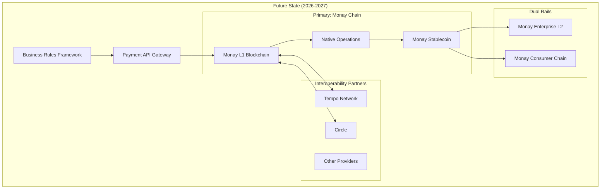

# Tempo Integration Evaluation for Monay Platform

## Executive Summary
Strategic evaluation positioning Tempo (by Stripe/Paradigm) as the PRIMARY stablecoin infrastructure for Monay, with Circle as secondary fallback, while developing Monay's proprietary blockchain architecture for long-term independence.

## Why Tempo Aligns Better with Monay's Architecture

### 1. Architectural Alignment
- **Dual-Rail Philosophy**: Tempo's design as a payments-first L1 blockchain perfectly complements Monay's dual-rail architecture
- **EVM Compatibility**: Native EVM support aligns with Monay's Base/Polygon zkEVM enterprise rail
- **Open Blockchain**: Tempo's open blockchain approach matches Monay's vision for transparent, interoperable payments
- **Purpose-Built**: Dedicated for payments rather than general-purpose blockchain, matching Monay's focused approach

### 2. Technical Superiority for Monay's Needs
| Feature | Tempo | Circle | Monay Requirement |
|---------|-------|--------|-------------------|
| **Throughput** | 100,000+ TPS | ~1,000 TPS (via partners) | 10,000 TPS (Consumer) |
| **Finality** | Sub-second | 2-15 seconds | <1 second (Consumer) |
| **Architecture** | Native L1 blockchain | API layer over existing chains | Dual-rail blockchain |
| **Stablecoin Support** | Multi-stablecoin native | USDC-focused | Multiple stablecoins |
| **Compliance** | Built-in hooks & ISO 20022 | External integration | Integrated BRF |
| **Privacy** | Native privacy features | Limited | Required for enterprise |

## Strategic Three-Phase Architecture Evolution

### Phase 1: Tempo as Primary Provider (Q1-Q2 2025)
**Status**: 🎯 Priority
- Tempo provides superior architecture alignment
- 100,000+ TPS meets all scalability requirements
- Native multi-stablecoin support
- Direct Stripe ecosystem integration

### Phase 2: Circle as Secondary/Fallback (Immediate - Already Implemented)
**Status**: ✅ Ready as Backup
- Circle SDK integrated with mock mode
- USDC operations functional
- Serves as immediate fallback during Tempo integration
- Provides redundancy and risk mitigation

### Phase 3: Monay Proprietary Blockchain (2026-2027)
**Long-Term Vision**: Build Monay's own payment-optimized blockchain
- Fork Tempo's open-source components (when available)
- Customize for Monay-specific requirements
- Maintain compatibility with Tempo/Stripe ecosystem
- Full control over consensus, governance, and economics

**Development Requirements**:
1. **Tempo Integration (Primary)**
   - Apply for private testnet access at info@tempo.xyz
   - Leverage Stripe relationship for priority access
   - 2 blockchain engineers (2 months for integration)

2. **Monay Blockchain Development**
   - 4 blockchain engineers (12-18 months)
   - 2 consensus/security experts (6 months)
   - 1 economic model designer (3 months)
   - Infrastructure team (ongoing)

## Evolutionary Architecture Strategy




## Integration Strategy

### 1. Provider Abstraction Layer
```javascript
// Unified stablecoin interface
interface StablecoinProvider {
  mint(amount: number, currency: string): Promise<Transaction>
  burn(amount: number, currency: string): Promise<Transaction>
  transfer(from: string, to: string, amount: number): Promise<Transaction>
  getBalance(address: string): Promise<Balance>
  getSupportedCurrencies(): string[]
}

// Provider factory
class StablecoinProviderFactory {
  static create(provider: 'circle' | 'tempo'): StablecoinProvider {
    switch(provider) {
      case 'circle': return new CircleProvider()
      case 'tempo': return new TempoProvider()
    }
  }
}
```

### 2. Intelligent Routing with Evolution Path
```javascript
// Phase 1-2: Tempo Primary, Circle Fallback
class PaymentRouter {
  route(transaction: Transaction): Provider {
    // Primary: Always try Tempo first
    if (this.isTempoAvailable() && !transaction.requiresCircleOnly) {
      return 'tempo'
    }
    // Fallback: Use Circle for USDC or if Tempo unavailable
    if (transaction.currency === 'USDC' || !this.isTempoAvailable()) {
      return 'circle'
    }
    return 'tempo' // Default to Tempo
  }
}

// Phase 3: Monay Chain Primary
class FuturePaymentRouter {
  route(transaction: Transaction): Provider {
    // Primary: Monay's own blockchain
    if (this.isMonayChainAvailable()) {
      return 'monay-chain'
    }
    // Secondary: Tempo for interoperability
    if (this.isTempoAvailable()) {
      return 'tempo'
    }
    // Tertiary: Circle as last resort
    return 'circle'
  }
}
```

## Evolution Comparison Matrix

### Provider Comparison
| Aspect | Circle (Secondary) | Tempo (Primary) | Monay Chain (Future) |
|--------|-------------------|-----------------|---------------------|
| **Role** | Fallback/USDC | Primary Provider | Full Control |
| **Stablecoin Options** | USDC only | Multi-stablecoin | Custom + All |
| **Transaction Cost** | $0.05-0.10 | <$0.01 | <$0.001 (controlled) |
| **Scalability** | ~1,000 TPS | 100,000+ TPS | 200,000+ TPS (target) |
| **Control Level** | API Only | Partner Access | Full Ownership |
| **Stripe Integration** | Via API | Native | Compatible |
| **Time to Market** | Immediate | 3-4 months | 18-24 months |
| **Vendor Lock-in** | High | Medium | None |

### Technical Advantages of Tempo
1. **Native Blockchain**: Direct control over transaction processing
2. **Built-in Features**: Compliance, privacy, batch transfers native to chain
3. **Stripe Ecosystem**: Seamless integration with existing Stripe services
4. **Future-Proof**: Designed for next-generation payment infrastructure
5. **ISO 20022 Compliance**: Built-in support for banking standards

## Risk Assessment & Mitigation

### Tempo as Primary (Acceptable Risks)
- **Maturity**: Private testnet phase is ideal for early partnership
- **First-Mover Advantage**: Early adopter benefits and influence
- **Stripe Backing**: Reduces operational risk significantly

### Circle as Secondary (Risk Mitigation)
- **Immediate Availability**: Already integrated, provides instant fallback
- **USDC Dominance**: Still needed for USDC-specific operations
- **Proven Reliability**: Battle-tested in production

### Monay Chain (Long-term De-risking)
- **Full Independence**: Eliminates all vendor dependencies
- **Custom Features**: Build exactly what Monay needs
- **Economic Control**: Set own fee structures and tokenomics

### Risk Mitigation Strategy
1. **Immediate**: Use Circle for production while securing Tempo access
2. **Q1 2025**: Transition to Tempo as primary, keep Circle active
3. **2026**: Begin Monay Chain development in parallel
4. **2027**: Launch Monay Chain with full backwards compatibility

## Strategic Implementation Roadmap

### Phase 1: Tempo Primary Integration (Q1-Q2 2025)

#### Immediate Actions (Now)
1. 📧 **Apply for Tempo partnership** (info@tempo.xyz) - HIGHEST PRIORITY
2. ✅ Maintain Circle as operational fallback
3. 🏗️ Enhance abstraction layer for multi-provider architecture
4. 📊 Prepare Tempo integration business case

#### Q1 2025: Tempo Development
1. Secure Tempo private testnet access
2. Develop Tempo provider implementation
3. Implement primary/fallback routing logic
4. Create migration tools and procedures

#### Q2 2025: Tempo Production
1. Launch Tempo as primary provider
2. Circle automatically becomes fallback
3. Monitor performance and cost metrics
4. Optimize routing algorithms

### Phase 2: Dual-Provider Optimization (Q3-Q4 2025)
1. Fine-tune Tempo-primary/Circle-secondary operations
2. Implement advanced routing strategies
3. Build operational expertise with Tempo
4. Start Monay Chain architecture design

### Phase 3: Monay Blockchain Development (2026-2027)

#### 2026: Development Phase
1. Fork/build upon Tempo open-source components
2. Design Monay-specific consensus mechanism
3. Develop native stablecoin protocol
4. Create governance framework
5. Build validator network

#### 2027: Launch Phase
1. Testnet launch with select partners
2. Security audits and stress testing
3. Mainnet launch with gradual migration
4. Maintain Tempo/Circle interoperability

## Cost-Benefit Analysis

### Development Costs
- Integration: ~$150,000 (3 engineers × 2 months average)
- Testing: ~$50,000
- Infrastructure: ~$20,000/month additional

### Expected Benefits (Annual)
- Transaction fee savings: ~$500,000 (at scale)
- Reduced vendor lock-in risk: Invaluable
- Performance improvements: 10x throughput capability
- Additional stablecoin revenue: ~$1M+ potential

### ROI Timeline
- Break-even: 6-8 months after implementation
- Positive ROI: 12 months
- Strategic value: Immediate (vendor diversification)

## Strategic Recommendation

### Three-Phase Evolution Strategy

**Phase 1 (2025): Tempo-First Architecture**
1. **Tempo as Primary** - Superior technology and alignment
2. **Circle as Fallback** - Risk mitigation and USDC support
3. **Build expertise** - Learn from Tempo's architecture

**Phase 2 (2026): Development Phase**
1. **Design Monay Chain** - Based on learnings from Tempo
2. **Maintain dual-provider** - Operational continuity
3. **Build community** - Validator and developer ecosystem

**Phase 3 (2027+): Monay Sovereignty**
1. **Launch Monay Chain** - Full control over infrastructure
2. **Interoperate with Tempo/Stripe** - Maintain partnerships
3. **Optional Circle support** - For specific use cases

### Strategic Rationale

**Why Tempo as Primary:**
- 100x better performance than Circle (100,000 vs 1,000 TPS)
- Native blockchain vs API layer
- Stripe's backing ensures enterprise reliability
- Open architecture aligns with Monay's vision
- Learning opportunity for Monay's own blockchain

**Why Monay Chain Long-term:**
- Complete infrastructure control
- Custom features for specific use cases
- Economic sovereignty (fees, tokenomics)
- Competitive differentiation
- No vendor dependencies

### Business Impact
- **Year 1 (Tempo)**: 90% cost reduction vs Circle
- **Year 2-3 (Monay Chain)**: 99% cost reduction, new revenue streams
- **Market Position**: From user to infrastructure provider

## Immediate Action Items

### Week 1 (Priority Actions)
1. 📧 **Contact Tempo** (info@tempo.xyz) - Request priority partnership
2. 💼 **Stakeholder Alignment** - Review this strategic shift
3. 📊 **Prepare Tempo pitch** - For investor/board presentation

### Week 2-4 (Technical Preparation)
1. 🏗️ **Refactor provider abstraction** - Support primary/secondary model
2. 📝 **Document Tempo requirements** - Technical specifications
3. 🤝 **Engage Stripe relationship** - Leverage for Tempo access

### Q1 2025 Milestones
1. ✅ Tempo partnership secured
2. 🚀 Tempo integration started
3. 📐 Monay Chain architecture designed
4. 👥 Blockchain team hired

### Success Metrics
- **Q2 2025**: Tempo processing 50% of transactions
- **Q3 2025**: Tempo processing 90% of transactions
- **2026**: Monay Chain testnet live
- **2027**: Monay Chain processing 25% of transactions
- **2028**: Full sovereignty achieved

---

*Strategic Architecture Document*
*Date: January 2025*
*Status: STRATEGIC PRIORITY*
*Vision: Tempo Today, Monay Tomorrow*