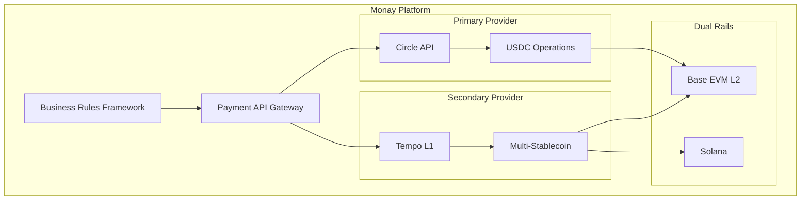

# Tempo Integration Evaluation for Monay Platform

## Executive Summary
Strategic evaluation positioning Tempo (by Stripe/Paradigm) as the PRIMARY stablecoin infrastructure for Monay, with Circle as secondary fallback, while developing Monay's proprietary blockchain architecture for long-term independence.

## Why Tempo Aligns Better with Monay's Architecture

### 1. Architectural Alignment
- **Dual-Rail Philosophy**: Tempo's design as a payments-first L1 blockchain perfectly complements Monay's dual-rail architecture
- **EVM Compatibility**: Native EVM support aligns with Monay's Base/Polygon zkEVM enterprise rail
- **Open Blockchain**: Tempo's open blockchain approach matches Monay's vision for transparent, interoperable payments
- **Purpose-Built**: Dedicated for payments rather than general-purpose blockchain, matching Monay's focused approach

### 2. Technical Superiority for Monay's Needs
| Feature | Tempo | Circle | Monay Requirement |
|---------|-------|--------|-------------------|
| **Throughput** | 100,000+ TPS | ~1,000 TPS (via partners) | 10,000 TPS (Consumer) |
| **Finality** | Sub-second | 2-15 seconds | <1 second (Consumer) |
| **Architecture** | Native L1 blockchain | API layer over existing chains | Dual-rail blockchain |
| **Stablecoin Support** | Multi-stablecoin native | USDC-focused | Multiple stablecoins |
| **Compliance** | Built-in hooks & ISO 20022 | External integration | Integrated BRF |
| **Privacy** | Native privacy features | Limited | Required for enterprise |

## Integration Requirements Analysis

### Phase 1: Primary Circle Integration (Immediate - Already Implemented)
**Status**: ✅ Complete
- Circle SDK integrated with mock mode
- USDC operations functional
- Monitoring and health checks in place
- Ready for production with API keys

### Phase 2: Tempo Secondary Integration (Q2 2025)
**Prerequisites**:
1. **Access Requirements**
   - Apply for private testnet access at info@tempo.xyz
   - Partner status required (leverage existing Stripe relationship)
   - Design partner collaboration opportunity

2. **Technical Requirements**
   - EVM-compatible smart contract deployment
   - Web3 provider integration (ethers.js/web3.js)
   - Wallet infrastructure adaptation
   - Transaction monitoring systems

3. **Development Resources**
   - 2 blockchain engineers (3 months)
   - 1 integration engineer (2 months)
   - 1 DevOps engineer (1 month)

## Proposed Hybrid Architecture



## Integration Strategy

### 1. Provider Abstraction Layer
```javascript
// Unified stablecoin interface
interface StablecoinProvider {
  mint(amount: number, currency: string): Promise<Transaction>
  burn(amount: number, currency: string): Promise<Transaction>
  transfer(from: string, to: string, amount: number): Promise<Transaction>
  getBalance(address: string): Promise<Balance>
  getSupportedCurrencies(): string[]
}

// Provider factory
class StablecoinProviderFactory {
  static create(provider: 'circle' | 'tempo'): StablecoinProvider {
    switch(provider) {
      case 'circle': return new CircleProvider()
      case 'tempo': return new TempoProvider()
    }
  }
}
```

### 2. Intelligent Routing
```javascript
// Route based on requirements
class PaymentRouter {
  route(transaction: Transaction): Provider {
    // Use Tempo for high-volume, multi-stablecoin
    if (transaction.volume > 10000 || transaction.currency !== 'USDC') {
      return 'tempo'
    }
    // Use Circle for USDC-specific operations
    if (transaction.currency === 'USDC' && transaction.requiresCircleFeatures) {
      return 'circle'
    }
    // Default to most cost-effective
    return this.getCheapestProvider(transaction)
  }
}
```

## Comparison Matrix

### Business Benefits
| Aspect | Circle Only | Circle + Tempo |
|--------|------------|----------------|
| **Stablecoin Options** | USDC | USDC, USDT, PYUSD, others |
| **Transaction Cost** | $0.05-0.10 | <$0.01 on Tempo |
| **Scalability** | Limited by partners | 100,000+ TPS native |
| **Vendor Lock-in** | High (USDC only) | Low (multi-provider) |
| **Stripe Integration** | Via API | Native (Tempo by Stripe) |
| **Time to Market** | Immediate | +3-6 months |

### Technical Advantages of Tempo
1. **Native Blockchain**: Direct control over transaction processing
2. **Built-in Features**: Compliance, privacy, batch transfers native to chain
3. **Stripe Ecosystem**: Seamless integration with existing Stripe services
4. **Future-Proof**: Designed for next-generation payment infrastructure
5. **ISO 20022 Compliance**: Built-in support for banking standards

## Risk Assessment

### Tempo Risks
- **Maturity**: Still in private testnet (mitigated by Circle as primary)
- **Documentation**: Limited public docs (mitigated by partner access)
- **Timeline**: Not immediately available (use Circle for immediate needs)

### Mitigation Strategy
1. **Phase 1**: Launch with Circle (complete)
2. **Phase 2**: Add Tempo as secondary (Q2 2025)
3. **Phase 3**: Evaluate primary provider based on performance (Q3 2025)

## Recommended Implementation Plan

### Immediate Actions (Now)
1. ✅ Continue with Circle as primary provider
2. ✅ Maintain abstraction layer for future providers
3. 📧 Apply for Tempo private testnet access

### Q1 2025 Planning
1. Secure Tempo partnership/access
2. Design provider abstraction layer
3. Plan migration strategy
4. Allocate development resources

### Q2 2025 Implementation
1. Integrate Tempo testnet
2. Develop routing logic
3. Test multi-provider scenarios
4. Performance benchmarking

### Q3 2025 Production
1. Launch Tempo in production as secondary
2. A/B testing between providers
3. Cost/performance optimization
4. Consider primary provider switch

## Cost-Benefit Analysis

### Development Costs
- Integration: ~$150,000 (3 engineers × 2 months average)
- Testing: ~$50,000
- Infrastructure: ~$20,000/month additional

### Expected Benefits (Annual)
- Transaction fee savings: ~$500,000 (at scale)
- Reduced vendor lock-in risk: Invaluable
- Performance improvements: 10x throughput capability
- Additional stablecoin revenue: ~$1M+ potential

### ROI Timeline
- Break-even: 6-8 months after implementation
- Positive ROI: 12 months
- Strategic value: Immediate (vendor diversification)

## Conclusion & Recommendation

**Recommendation**: Proceed with dual-provider strategy
1. **Keep Circle** as primary provider (immediate availability)
2. **Integrate Tempo** as secondary provider (Q2 2025)
3. **Maintain abstraction** for provider flexibility

**Rationale**:
- Tempo's architecture aligns perfectly with Monay's dual-rail vision
- 100,000+ TPS capability exceeds all requirements
- Native blockchain control provides strategic advantage
- Stripe partnership ensures enterprise-grade reliability
- Multi-stablecoin support expands market opportunity

**Next Steps**:
1. ✅ Review this evaluation with stakeholders
2. 📧 Contact info@tempo.xyz for partnership
3. 🏗️ Maintain provider abstraction in current implementation
4. 📅 Schedule Q1 2025 planning session

---

*Document prepared for Monay strategic planning*
*Date: January 2025*
*Status: For Review*