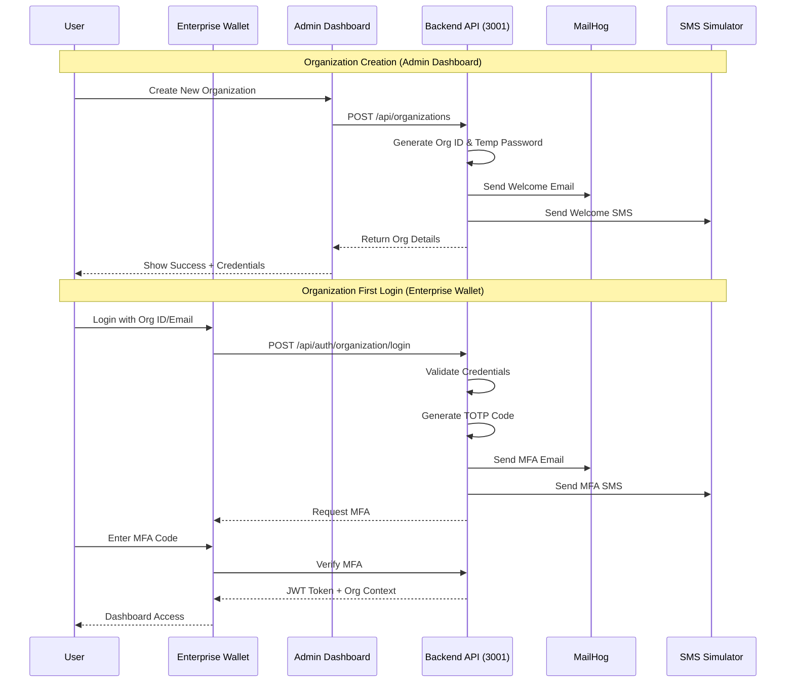

# Organization Architecture Analysis & Recommendations

## Current State Analysis

### Existing Implementation
- **Location**: Organization module currently exists in Enterprise Wallet (port 3007)
- **Path**: `/monay-caas/monay-enterprise-wallet/src/app/(dashboard)/organizations/`
- **Features**:
  - Organization creation and management
  - Multi-tenant support
  - Organization login at `/auth/organization/login`
  - Organization switcher component
  - Mock data with various industry verticals

### Notification Infrastructure
- **MailHog**: Running on port 8025 for email testing
- **SMS Simulator**: Running on port 3030 for SMS testing
- **Integration**: Notification service already integrated with MFA code sending

## Key Architectural Questions

### 1. Where Should Organization Management Reside?

#### Option A: Admin Dashboard (Port 3002) - RECOMMENDED
**Pros:**
- Centralized administrative control
- Clear separation of concerns (admin vs enterprise operations)
- Better suited for platform-wide organization management
- Aligns with typical SaaS architecture patterns
- Easier to implement cross-organization reporting and analytics

**Cons:**
- Requires migrating existing code from Enterprise Wallet
- Need to establish communication between Admin and Enterprise Wallet

#### Option B: Enterprise Wallet (Port 3007) - Current State
**Pros:**
- Already implemented
- Direct access to wallet and treasury operations
- Faster organization-specific operations

**Cons:**
- Mixes administrative and operational concerns
- Harder to implement platform-wide controls
- Confusing for super-admins managing multiple organizations

### 2. Organization Authentication Flow with TOTP

#### Recommended Flow:



### 3. Holding Company Structure

#### Recommended Hierarchy Model:

```
Platform (Monay)
├── Holding Company A
│   ├── Organization A1 (Subsidiary)
│   │   ├── Department A1.1
│   │   └── Department A1.2
│   ├── Organization A2 (Subsidiary)
│   └── Organization A3 (Subsidiary)
├── Holding Company B
│   └── Organization B1
└── Standalone Organization C
```

#### Implementation Strategy:
1. **Parent-Child Relationships**: Add `parent_organization_id` field
2. **Inheritance Rules**: Settings cascade from parent to child
3. **Permissions Model**: Role-based with organization scope
4. **Resource Sharing**: Cross-organization wallet transfers for subsidiaries

## Recommended Implementation Plan

### Phase 1: Refactor Organization Module (Week 1-2)
1. **Move Core Organization Management to Admin Dashboard**
   - Organization CRUD operations
   - KYC/Compliance management
   - Platform-wide organization views

2. **Keep in Enterprise Wallet**
   - Organization context/switching
   - Organization-specific operations
   - Wallet management within organization

### Phase 2: Implement TOTP Flow (Week 2-3)
1. **Backend API Endpoints**
   ```javascript
   // New endpoints needed in monay-backend-common
   POST /api/organizations          // Create organization
   POST /api/organizations/:id/verify-email
   POST /api/organizations/:id/verify-sms
   POST /api/auth/organization/login
   POST /api/auth/organization/mfa/send
   POST /api/auth/organization/mfa/verify
   GET  /api/organizations/:id/children  // For holding companies
   ```

2. **Database Schema**
   ```sql
   -- Organizations table enhancement
   ALTER TABLE organizations ADD COLUMN
     parent_organization_id UUID REFERENCES organizations(id),
     organization_type VARCHAR(50), -- 'holding', 'subsidiary', 'standalone'
     email_verified BOOLEAN DEFAULT FALSE,
     phone_verified BOOLEAN DEFAULT FALSE,
     mfa_enabled BOOLEAN DEFAULT TRUE,
     mfa_methods JSONB DEFAULT '["email", "sms"]';
   ```

### Phase 3: Self-Service Flow (Week 3-4)
1. **Public Registration Page** (`/register/organization`)
   - Industry selection
   - Company details form
   - Automatic KYC initiation
   - Email/SMS verification via TOTP

2. **Verification Process**
   - Send verification codes to MailHog/SMS Simulator
   - 6-digit TOTP codes with 10-minute expiry
   - Store verification status in database

### Phase 4: Holding Company Features (Week 4-5)
1. **Subsidiary Management**
   - Create child organizations from parent dashboard
   - Inherit compliance settings
   - Consolidated reporting views

2. **Cross-Organization Operations**
   - Inter-company transfers
   - Shared treasury management
   - Consolidated compliance scoring

## Technical Implementation Details

### 1. Organization Service (Backend)
```javascript
// /monay-backend-common/src/services/organizationService.js
class OrganizationService {
  async createOrganization(data) {
    // Generate unique org ID
    const orgId = `org-${Date.now()}`

    // Create organization record
    const org = await db.organizations.create({
      id: orgId,
      ...data,
      status: 'pending_verification'
    })

    // Send verification emails/SMS
    await notificationService.sendWelcome(org)
    await notificationService.sendVerificationCode(org)

    return org
  }

  async verifyOrganization(orgId, code, method) {
    // Verify TOTP code
    const isValid = await totpService.verify(orgId, code, method)

    if (isValid) {
      await db.organizations.update(orgId, {
        [`${method}_verified`]: true,
        status: 'active'
      })
    }

    return isValid
  }

  async createSubsidiary(parentOrgId, subsidiaryData) {
    // Verify parent organization exists and has permission
    const parent = await db.organizations.findById(parentOrgId)

    if (!parent || parent.organization_type !== 'holding') {
      throw new Error('Invalid parent organization')
    }

    // Create subsidiary with inherited settings
    return this.createOrganization({
      ...subsidiaryData,
      parent_organization_id: parentOrgId,
      organization_type: 'subsidiary',
      compliance_settings: parent.compliance_settings
    })
  }
}
```

### 2. Admin Dashboard Organization Page
```typescript
// /monay-admin/src/app/organizations/page.tsx
export default function OrganizationsAdminPage() {
  return (
    <div>
      <Tabs>
        <TabsList>
          <TabsTrigger value="all">All Organizations</TabsTrigger>
          <TabsTrigger value="pending">Pending Verification</TabsTrigger>
          <TabsTrigger value="holding">Holding Companies</TabsTrigger>
        </TabsList>

        <TabsContent value="all">
          <OrganizationsList
            showCreateButton={true}
            showBulkActions={true}
            showComplianceScores={true}
          />
        </TabsContent>

        <TabsContent value="pending">
          <PendingVerificationList
            showVerificationActions={true}
            showResendOptions={true}
          />
        </TabsContent>

        <TabsContent value="holding">
          <HoldingCompanyTree
            showSubsidiaries={true}
            allowCreateChild={true}
          />
        </TabsContent>
      </Tabs>
    </div>
  )
}
```

### 3. Enterprise Wallet Integration
```typescript
// Keep lightweight organization context in Enterprise Wallet
interface OrganizationContext {
  currentOrg: Organization
  subsidiaries?: Organization[]
  canSwitchOrg: boolean
  switchOrganization: (orgId: string) => void
}
```

## Migration Strategy

### Step 1: Database Migration
1. Add new fields to organizations table
2. Create organization_verifications table for TOTP codes
3. Add parent_organization_id for hierarchy

### Step 2: Code Migration
1. Copy organization components to Admin Dashboard
2. Refactor for administrative use
3. Create API endpoints in backend-common
4. Update Enterprise Wallet to use new endpoints

### Step 3: Testing with MailHog/SMS Simulator
1. Test organization creation flow
2. Verify TOTP codes via MailHog (port 8025)
3. Verify SMS codes via SMS Simulator (port 3030)
4. Test holding company creation

## Security Considerations

1. **MFA Requirements**
   - Mandatory for organization admins
   - Optional for regular users
   - Configurable methods per organization

2. **Verification Process**
   - Email domain verification for organizations
   - Phone number verification via SMS
   - Document upload for KYC

3. **Access Control**
   - Organization-scoped JWT tokens
   - Role-based permissions within organizations
   - Cross-organization access for holding companies only

## Benefits of Recommended Approach

1. **Clear Separation of Concerns**
   - Admin Dashboard: Platform administration
   - Enterprise Wallet: Organization operations
   - Backend API: Centralized business logic

2. **Scalability**
   - Support for complex organizational structures
   - Efficient subsidiary management
   - Consolidated reporting capabilities

3. **Security**
   - Robust verification process
   - MFA at organization level
   - Granular access controls

4. **User Experience**
   - Self-service organization creation
   - Seamless subsidiary onboarding
   - Intuitive organization switching

## Next Steps

1. **Immediate Actions**
   - Review and approve architecture proposal
   - Create database migration scripts
   - Set up TOTP service in backend

2. **Development Priority**
   - Week 1: Move organization management to Admin Dashboard
   - Week 2: Implement TOTP verification flow
   - Week 3: Add holding company support
   - Week 4: Testing and refinement

3. **Testing Strategy**
   - Use MailHog for email verification testing
   - Use SMS Simulator for phone verification
   - Create test holding company structures
   - Validate permission inheritance

## Conclusion

The recommended approach moves organization management to the Admin Dashboard while maintaining operational features in the Enterprise Wallet. This provides better separation of concerns, supports complex organizational structures, and enables robust verification flows using the existing MailHog and SMS Simulator infrastructure.

The TOTP-based verification ensures security while the holding company structure supports enterprise needs. The phased implementation allows for incremental development and testing.