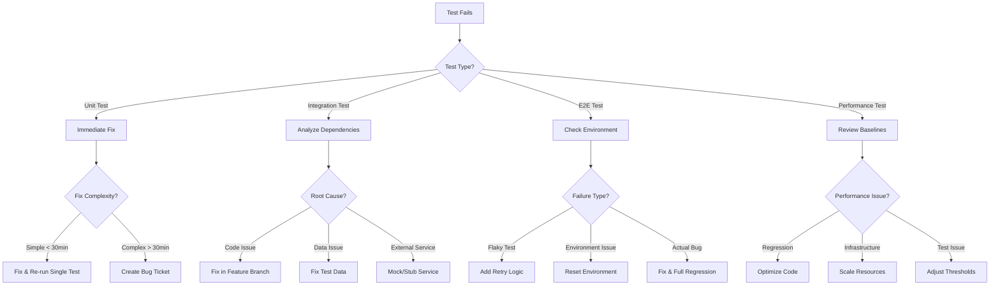

# Test Failure Handling & Recovery Strategy
## Monay Enterprise Wallet - Test Failure Management Protocol
### Version 1.0.0 - January 21, 2025

---

## 🚨 When a Test Fails: Decision Flow Chart



---

## 📋 Test Failure Categories & Actions

### 1. Critical Test Failures (P0)
**Definition**: Failures that block deployment or break core functionality

#### Immediate Actions:
```yaml
Critical_Failure_Response:
  1_Alert:
    - Notify: Development Team Lead
    - Slack: #critical-alerts channel
    - PagerDuty: Trigger incident

  2_Isolate:
    - Stop: Current test suite execution
    - Rollback: Any database changes
    - Preserve: Test artifacts and logs

  3_Analyze:
    - Capture: Full stack trace
    - Screenshot: UI state (if applicable)
    - Database: Current state snapshot
    - Logs: Last 1000 lines from all services

  4_Decision:
    if: Quick fix possible (< 1 hour)
      then: Fix immediately and restart full test suite
    else:
      - Create P0 bug ticket
      - Implement temporary workaround
      - Continue testing other areas
      - Schedule emergency fix
```

#### Example Critical Failures:
- Authentication system completely broken
- Payment processing failing for all transactions
- Database connection lost
- Smart contract deployment failing
- Complete UI crash on load

### 2. Major Test Failures (P1)
**Definition**: Failures affecting important features but not blocking all testing

#### Response Protocol:
```javascript
class MajorFailureHandler {
  async handle(failure) {
    // 1. Log the failure with context
    await this.logFailure({
      severity: 'MAJOR',
      testName: failure.test,
      error: failure.error,
      timestamp: new Date(),
      environment: process.env.NODE_ENV
    });

    // 2. Determine impact scope
    const impact = await this.analyzeImpact(failure);

    // 3. Decision tree
    if (impact.affectsOtherTests) {
      // Skip related tests
      await this.skipDependentTests(impact.dependencies);

      // Continue with unaffected tests
      await this.continueTestSuite({
        skip: impact.dependencies,
        reason: `Blocked by ${failure.test}`
      });
    } else {
      // Mark as known issue and continue
      await this.markKnownIssue(failure);
      await this.continueTestSuite();
    }

    // 4. Create bug ticket
    const ticket = await this.createBugTicket({
      priority: 'P1',
      assignee: this.getResponsibleDeveloper(failure),
      dueDate: this.calculateDueDate('P1'),
      description: this.generateBugReport(failure)
    });

    return {
      action: 'CONTINUE_WITH_KNOWN_ISSUE',
      ticket: ticket.id,
      skipTests: impact.dependencies
    };
  }
}
```

### 3. Minor Test Failures (P2)
**Definition**: Non-critical issues that don't block functionality

#### Handling Process:
```bash
#!/bin/bash
# minor-failure-handler.sh

handle_minor_failure() {
  local test_name=$1
  local error_msg=$2

  # Log to tracking file
  echo "$(date): $test_name - $error_msg" >> test-failures.log

  # Check if known issue
  if grep -q "$test_name" known-issues.txt; then
    echo "Known issue - continuing tests"
    return 0
  fi

  # Add to known issues for this run
  echo "$test_name" >> known-issues.txt

  # Create low-priority ticket in backlog
  create_backlog_ticket "$test_name" "$error_msg"

  # Continue testing
  return 0
}
```

### 4. Flaky Test Failures
**Definition**: Tests that fail intermittently without code changes

#### Flaky Test Management:
```typescript
interface FlakyTestStrategy {
  maxRetries: number;
  retryDelay: number;
  quarantineThreshold: number;
}

class FlakyTestManager {
  private flakyTests = new Map<string, FlakyTestHistory>();

  async handleFlakyTest(testName: string, error: Error): Promise<TestResult> {
    const history = this.flakyTests.get(testName) || new FlakyTestHistory();
    history.addFailure(error);

    // Retry logic
    if (history.failureCount <= this.config.maxRetries) {
      console.log(`Retrying flaky test: ${testName} (attempt ${history.failureCount})`);
      await this.delay(this.config.retryDelay);
      return await this.retryTest(testName);
    }

    // Quarantine if exceeds threshold
    if (history.flakyRate > this.config.quarantineThreshold) {
      await this.quarantineTest(testName);
      return {
        status: 'QUARANTINED',
        message: `Test quarantined due to ${history.flakyRate}% flaky rate`
      };
    }

    return {
      status: 'FAILED',
      requiresFix: true
    };
  }

  private async quarantineTest(testName: string) {
    // Move test to quarantine suite
    await this.moveToQuarantine(testName);

    // Create ticket for fixing
    await this.createFlakyTestTicket(testName);

    // Notify team
    await this.notifyTeam({
      test: testName,
      action: 'QUARANTINED',
      reason: 'Exceeded flaky threshold'
    });
  }
}
```

---

## 🔄 Test Recovery Strategies

### Strategy 1: Selective Re-run
```javascript
// selective-rerun.js
class SelectiveTestRunner {
  async rerunFailedTests(testReport) {
    const failedTests = testReport.failures;
    const rerunResults = [];

    for (const test of failedTests) {
      // Determine if test should be re-run
      if (this.shouldRerun(test)) {
        console.log(`Re-running: ${test.name}`);

        // Clean up test environment
        await this.cleanupTestEnvironment(test);

        // Re-run single test
        const result = await this.runSingleTest(test);
        rerunResults.push(result);

        if (result.passed) {
          console.log(`✅ Test passed on re-run: ${test.name}`);
        } else {
          console.log(`❌ Test failed again: ${test.name}`);
          await this.handlePersistentFailure(test);
        }
      }
    }

    return this.generateRerunReport(rerunResults);
  }

  shouldRerun(test) {
    // Don't rerun if:
    // - Already retried max times
    // - Known environment issue
    // - Marked as "won't fix"
    return !test.maxRetriesReached &&
           !test.knownIssue &&
           !test.wontFix;
  }
}
```

### Strategy 2: Parallel Recovery
```yaml
# parallel-recovery.yml
recovery_strategy:
  parallel_execution:
    - stream_1:
        name: "Critical Path Tests"
        tests: ["auth", "payments", "wallet"]
        on_failure: "STOP_ALL"

    - stream_2:
        name: "Feature Tests"
        tests: ["invoices", "reports", "settings"]
        on_failure: "CONTINUE_OTHERS"

    - stream_3:
        name: "Integration Tests"
        tests: ["api", "database", "external"]
        on_failure: "ISOLATE_AND_CONTINUE"

  recovery_actions:
    STOP_ALL:
      - stop_all_streams
      - preserve_state
      - alert_team
      - await_fix

    CONTINUE_OTHERS:
      - mark_stream_failed
      - continue_other_streams
      - create_bug_ticket

    ISOLATE_AND_CONTINUE:
      - isolate_failure
      - mock_failed_service
      - continue_with_mocks
```

### Strategy 3: Smart Test Ordering
```typescript
class SmartTestScheduler {
  async scheduleTests(testSuite: Test[]): Promise<Test[]> {
    // Order tests by:
    // 1. Criticality
    // 2. Historical pass rate
    // 3. Execution time
    // 4. Dependencies

    return testSuite.sort((a, b) => {
      const scoreA = this.calculateTestScore(a);
      const scoreB = this.calculateTestScore(b);
      return scoreB - scoreA; // Higher score runs first
    });
  }

  calculateTestScore(test: Test): number {
    const weights = {
      criticality: 0.4,
      passRate: 0.3,
      executionTime: 0.2,
      dependencies: 0.1
    };

    return (
      test.criticality * weights.criticality +
      test.historicalPassRate * weights.passRate +
      (1 / test.avgExecutionTime) * weights.executionTime +
      test.dependencyCount * weights.dependencies
    );
  }

  async rescheduleAfterFailure(failure: TestFailure): Promise<void> {
    // Move dependent tests to end of queue
    const dependentTests = this.getDependentTests(failure.test);
    await this.moveTestsToEnd(dependentTests);

    // Add isolation tests if needed
    if (failure.requiresIsolation) {
      await this.addIsolationTests(failure.test);
    }
  }
}
```

---

## 🛠️ Fix Priority Matrix

| Failure Type | Business Impact | Fix Timeline | Action Required | Who Fixes |
|-------------|----------------|--------------|-----------------|-----------|
| **Payment Processing** | Critical | Immediate (< 1hr) | Stop all testing, all hands on deck | Senior Dev Team |
| **Authentication** | Critical | Immediate (< 1hr) | Block deployment, hotfix required | Security Team |
| **Data Corruption** | Critical | Immediate (< 2hr) | Rollback, investigate root cause | Database Team |
| **UI Complete Crash** | High | Same day (< 4hr) | Fix before next test cycle | Frontend Team |
| **API Endpoint Failure** | High | Same day (< 4hr) | API team investigation | Backend Team |
| **Business Logic Error** | Medium | Next day (< 24hr) | Schedule fix for next sprint | Feature Team |
| **Performance Degradation** | Medium | This week (< 3 days) | Optimization task created | Performance Team |
| **Visual/CSS Issues** | Low | Next sprint | Add to backlog | UI/UX Team |
| **Edge Case Failures** | Low | When possible | Document as known issue | Assigned Dev |

---

## 📊 Test Failure Metrics & Tracking

### Key Metrics to Monitor
```javascript
class TestMetricsCollector {
  metrics = {
    totalTests: 0,
    passedTests: 0,
    failedTests: 0,
    skippedTests: 0,
    flakyTests: 0,
    averageExecutionTime: 0,
    failureRate: 0,
    mttr: 0, // Mean Time To Repair
    testCoverage: 0
  };

  async collectMetrics(testRun: TestRun): Promise<TestMetrics> {
    return {
      timestamp: new Date(),
      runId: testRun.id,
      duration: testRun.duration,

      // Success metrics
      passRate: (testRun.passed / testRun.total) * 100,
      failureRate: (testRun.failed / testRun.total) * 100,

      // Failure analysis
      failuresByCategory: this.categorizeFailures(testRun.failures),
      topFailingTests: this.getTopFailingTests(testRun.failures, 10),

      // Trends
      trend: this.calculateTrend(testRun),

      // Recovery metrics
      rerunSuccessRate: this.calculateRerunSuccess(testRun),
      averageFixTime: this.calculateAverageFixTime(testRun.failures),

      // Recommendations
      recommendations: this.generateRecommendations(testRun)
    };
  }

  generateRecommendations(testRun: TestRun): string[] {
    const recommendations = [];

    if (testRun.failureRate > 10) {
      recommendations.push('High failure rate detected - consider code freeze');
    }

    if (testRun.flakyTests > 5) {
      recommendations.push('Multiple flaky tests - review test stability');
    }

    if (testRun.duration > this.baseline * 1.5) {
      recommendations.push('Test suite running slow - consider parallelization');
    }

    return recommendations;
  }
}
```

### Failure Tracking Dashboard
```yaml
dashboard_config:
  panels:
    - failure_trend:
        type: line_chart
        metrics: [failure_rate, pass_rate]
        timeframe: last_30_days

    - failure_heatmap:
        type: heatmap
        dimensions: [test_suite, time_of_day]
        metric: failure_count

    - top_failures:
        type: table
        columns: [test_name, failure_count, last_failure, assigned_to]
        limit: 20

    - mttr_gauge:
        type: gauge
        metric: mean_time_to_repair
        thresholds:
          green: "< 2 hours"
          yellow: "2-6 hours"
          red: "> 6 hours"

    - test_stability:
        type: pie_chart
        categories: [stable, flaky, broken]

  alerts:
    - high_failure_rate:
        condition: failure_rate > 15%
        action: notify_team_lead

    - increasing_flakiness:
        condition: flaky_rate > 10%
        action: schedule_test_review

    - long_running_failure:
        condition: unresolved_failure > 24h
        action: escalate_to_manager
```

---

## 🔧 Automated Failure Response System

### Implementation
```typescript
class AutomatedFailureResponse {
  private responseStrategies = new Map<FailureType, ResponseStrategy>();

  constructor() {
    this.registerStrategies();
  }

  private registerStrategies() {
    // Register automated responses for different failure types
    this.responseStrategies.set(FailureType.TIMEOUT, new TimeoutResponse());
    this.responseStrategies.set(FailureType.ASSERTION, new AssertionResponse());
    this.responseStrategies.set(FailureType.NETWORK, new NetworkResponse());
    this.responseStrategies.set(FailureType.DATABASE, new DatabaseResponse());
    this.responseStrategies.set(FailureType.PERMISSION, new PermissionResponse());
  }

  async handleFailure(failure: TestFailure): Promise<ResponseResult> {
    const failureType = this.identifyFailureType(failure);
    const strategy = this.responseStrategies.get(failureType);

    if (!strategy) {
      return this.handleUnknownFailure(failure);
    }

    // Execute automated response
    const response = await strategy.execute(failure);

    // Log response
    await this.logResponse(failure, response);

    // Determine next action
    if (response.fixed) {
      return { action: 'CONTINUE_TESTING', details: response };
    } else if (response.workaroundApplied) {
      return { action: 'CONTINUE_WITH_WORKAROUND', details: response };
    } else {
      return { action: 'ESCALATE', details: response };
    }
  }
}

// Example response strategies
class TimeoutResponse implements ResponseStrategy {
  async execute(failure: TestFailure): Promise<Response> {
    // Increase timeout and retry
    const newTimeout = failure.timeout * 2;

    try {
      const result = await this.retryWithTimeout(failure.test, newTimeout);
      if (result.passed) {
        // Update test configuration
        await this.updateTestTimeout(failure.test, newTimeout);
        return { fixed: true, action: 'Increased timeout' };
      }
    } catch (error) {
      // Try alternative approach
      return await this.tryAlternativeApproach(failure);
    }

    return { fixed: false, requiresManualIntervention: true };
  }
}

class NetworkResponse implements ResponseStrategy {
  async execute(failure: TestFailure): Promise<Response> {
    // Check network connectivity
    const networkStatus = await this.checkNetwork();

    if (!networkStatus.isConnected) {
      // Wait and retry
      await this.delay(5000);
      const retryStatus = await this.checkNetwork();

      if (retryStatus.isConnected) {
        return { fixed: true, action: 'Network recovered' };
      }
    }

    // Switch to mock mode
    await this.enableMockMode(failure.test);
    return {
      workaroundApplied: true,
      action: 'Switched to mock mode due to network issues'
    };
  }
}
```

---

## 📝 Test Failure Documentation Template

### Bug Report Template
```markdown
## Test Failure Report

**Test Name**: [Test that failed]
**Test Suite**: [Parent suite]
**Failure Time**: [Timestamp]
**Environment**: [Dev/Staging/Prod]
**Build Number**: [CI/CD build number]

### Failure Details
**Error Type**: [Assertion/Timeout/Network/etc]
**Error Message**:
```
[Full error message]
```

**Stack Trace**:
```
[Full stack trace]
```

### Steps to Reproduce
1. [Step 1]
2. [Step 2]
3. [Step 3]

### Expected vs Actual
- **Expected**: [What should happen]
- **Actual**: [What actually happened]

### Impact Assessment
- **Severity**: [P0/P1/P2/P3]
- **Affected Features**: [List of features]
- **User Impact**: [Description of user impact]
- **Business Impact**: [Revenue/Operations impact]

### Investigation Notes
- [Any findings during investigation]
- [Potential root causes]
- [Related issues or patterns]

### Proposed Fix
- **Solution**: [Proposed solution]
- **Estimated Time**: [Time to fix]
- **Risk Assessment**: [Risk of fix]
- **Testing Required**: [Additional tests needed]

### Workaround
- [Temporary workaround if available]

### Attachments
- [ ] Screenshots
- [ ] Logs
- [ ] Database state
- [ ] Network traces
```

---

## 🚀 Continuous Improvement Process

### Post-Failure Review Process
```yaml
post_failure_review:
  schedule: "After each test cycle"

  participants:
    - QA Lead
    - Development Team
    - Product Owner
    - DevOps (if infrastructure-related)

  agenda:
    1_failure_analysis:
      - Review all failures from cycle
      - Categorize by type and severity
      - Identify patterns and trends

    2_root_cause_analysis:
      - Deep dive into P0/P1 failures
      - Use 5-why technique
      - Document findings

    3_action_items:
      - Assign fix ownership
      - Set deadlines
      - Define success criteria

    4_process_improvement:
      - Update test strategies
      - Refine failure handling procedures
      - Adjust automation rules

    5_preventive_measures:
      - Add new test cases
      - Improve monitoring
      - Update documentation

  deliverables:
    - Failure analysis report
    - Action item tracker
    - Updated test strategy
    - Lessons learned document
```

### Test Stability Improvement Plan
```javascript
class TestStabilityImprover {
  async improveTestStability(testSuite: TestSuite): Promise<ImprovementPlan> {
    const analysis = await this.analyzeTestStability(testSuite);

    return {
      immediateActions: [
        'Fix all P0 failures within 24 hours',
        'Quarantine tests with >30% failure rate',
        'Add retry logic to network-dependent tests'
      ],

      shortTermActions: [
        'Refactor flaky tests identified in analysis',
        'Improve test data management',
        'Add better error messages and logging'
      ],

      longTermActions: [
        'Implement service virtualization for external dependencies',
        'Create comprehensive test environment provisioning',
        'Develop AI-based failure prediction system'
      ],

      metrics: {
        targetPassRate: 98,
        targetFlakyRate: 2,
        targetMTTR: 120, // minutes
        reviewFrequency: 'weekly'
      }
    };
  }
}
```

---

## 🎯 Quick Reference: Failure Response Flowchart

```
Test Fails
    ↓
Is it blocking deployment?
    → YES: CRITICAL PATH (Fix immediately)
    → NO: Continue ↓

Is it a regression?
    → YES: HIGH PRIORITY (Fix within 4 hours)
    → NO: Continue ↓

Has it failed before?
    → YES: Check if FLAKY (Add to quarantine)
    → NO: Continue ↓

Can it be fixed quickly?
    → YES: FIX & RERUN (< 30 minutes)
    → NO: Continue ↓

Create ticket, document workaround, continue testing
```

---

## 📌 Key Takeaways

### DO's ✅
1. **Always preserve test artifacts** when failures occur
2. **Document the failure** immediately with full context
3. **Communicate failures** to relevant team members
4. **Prioritize fixes** based on business impact
5. **Learn from failures** to prevent recurrence
6. **Automate recovery** where possible
7. **Track metrics** to identify patterns

### DON'Ts ❌
1. **Don't ignore intermittent failures** - they often indicate real issues
2. **Don't fix symptoms** - find and fix root causes
3. **Don't skip retesting** after fixes
4. **Don't accumulate technical debt** - fix flaky tests
5. **Don't test in production** without proper safeguards
6. **Don't blame individuals** - focus on process improvement
7. **Don't continue testing** if critical infrastructure is broken

---

**Version**: 1.0.0
**Last Updated**: January 21, 2025
**Next Review**: February 1, 2025
**Owner**: QA Team
**Status**: Active